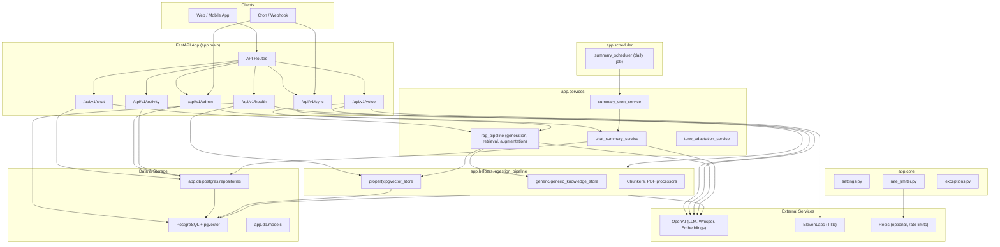
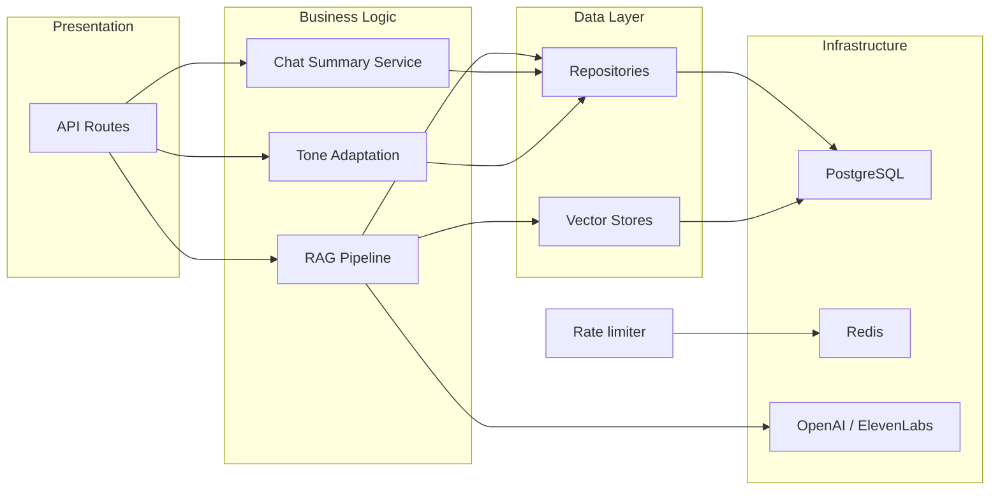

# Overall Architecture

## High-Level Component Diagram

---

## Layer Overview

---

## Tech Stack

| Layer            | Technology                                    |
| ---------------- | --------------------------------------------- |
| API              | FastAPI, Pydantic                             |
| Rate limiting    | SlowAPI (Redis or in-memory)                  |
| Database         | PostgreSQL (SQLAlchemy sync + async)          |
| Vector search    | pgvector (in PostgreSQL)                      |
| LLM & embeddings | OpenAI (e.g. gpt-4o, text-embedding-3-small)  |
| Voice            | OpenAI Whisper (transcribe), ElevenLabs (TTS) |
| Background       | In-app asyncio task (summary scheduler)       |

---

## Configuration

Key settings live in **`app/core/settings.py`** (Pydantic, `.env`, case-insensitive):

| Setting            | Env var                                 | Default             | Purpose               |
| ------------------ | --------------------------------------- | ------------------- | --------------------- |
| Database           | `DATABASE_URL`                          | (required)          | PostgreSQL connection |
| Rate limiting      | `RATE_LIMIT_ENABLED`                    | `false`             | Enable SlowAPI limits |
| Rate limit default | `RATE_LIMIT_PER_MINUTE`                 | `60`                | Global default limit  |
| Redis              | `REDIS_URL`                             | (empty → in-memory) | Rate limit storage    |
| Pool / DB          | `db_pool_size`, `db_max_overflow`, etc. | (see settings)      | Engine/pool tuning    |

Other env (used outside Pydantic settings):

- **OpenAI:** `OPENAI_API_KEY`, `OPENAI_MODEL`
- **ElevenLabs:** `ELEVENLABS_API_KEY`
- **Sync:** `WEBHOOK_SECRET`, `REQUIRE_WEBHOOK_SECRET`
- **Scheduler:** `SUMMARY_CRON_HOUR`, `SUMMARY_CRON_MINUTE`, `ENABLE_INAPP_SUMMARY_CRON`
- **RAG:** `TONE_ADAPTATION_MIN_USER_MESSAGES`, `DEBUG`, generic PDF limits, etc.

---

## Route Mounting (main.py)

Routers are included with their own prefix:

- `chat_router` → `/api/v1/chat`
- `voice_router` → `/api/v1/voice`
- `sync_router` → `/api/v1/sync`
- `admin_router` → `/api/v1/admin`
- `activity_router` → `/api/v1/activity`
- `health_router` → `/api/v1/health`

Lifespan: starts **summary scheduler** task; on shutdown cancels it and calls **close_db()**.
