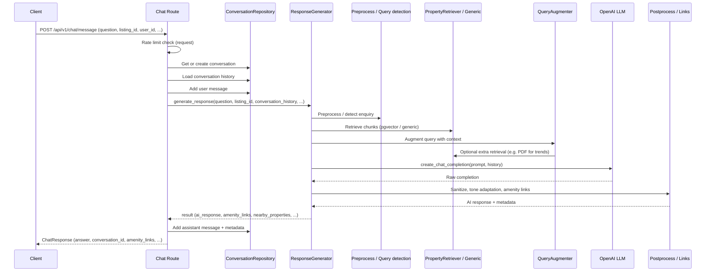

# Chat and RAG Flow

## Chat Request End-to-End

`POST /api/v1/chat/message` handles property and general real-estate Q&A using a RAG pipeline over listing data and optional generic knowledge.

---

## Sequence Diagram (Simplified)

---

## RAG Pipeline Stages (generation.py)

```mermaid
flowchart LR
    A[User question] --> B[Preprocess / Enquiry detection]
    B --> C[Query source: listing vs generic]
    C --> D[Retrieve: PropertyRetriever and/or GenericKnowledgeStore]
    D --> E[Augment: merge PDF / trend chunks if needed]
    E --> F[Build prompt + conversation context]
    F --> G[OpenAI chat completion]
    G --> H[Sanitize response]
    H --> I[Tone adaptation if many messages]
    I --> J[Amenity / Google Maps links if amenity query]
    J --> K[Return answer + metadata]
```

---

## Key Components

| Component | Location | Role |
|-----------|----------|------|
| Chat route | `app/api/v1/routes/chat.py` | Rate limit, get/create conversation, load history, call generator, persist messages |
| ResponseGenerator | `app/services/rag_pipeline/generation.py` | Orchestrates preprocess → retrieval → augmentation → LLM → postprocess |
| PropertyRetriever | `app/services/rag_pipeline/retrieval.py` (and related) | Fetches chunks from pgvector for a listing |
| GenericKnowledgeStore | `app/helpers/ingestion_pipeline/generic/generic_knowledge_store.py` | Generic real-estate knowledge retrieval |
| Query augmentation | `app/services/rag_pipeline/augmentation.py` | Merges PDF/trend chunks when needed (e.g. price trends) |
| Prompts | `app/services/rag_pipeline/prompts.py` | System/user prompt building |
| LLM client | `app/services/rag_pipeline/llms.py` | OpenAI chat completion |
| Amenity links | `app/services/rag_pipeline/google_maps_links.py` | Google Maps links for amenity queries (when lat/lon available) |
| Tone adaptation | `app/services/tone_adaptation_service.py` | Activity-based tone when `total_user_messages >= TONE_ADAPTATION_MIN_USER_MESSAGES` |

---

## Conversation and Listing Context

- If **user_id** is provided: conversation is fetched or created; history is loaded and sent to the generator; user and assistant messages are stored.
- **listing_id** drives property-specific retrieval (pgvector) and optional listing location for amenity links.
- **source** can influence enquiry vs conversational handling.

---

## Modifications Guide

- **Change chat behaviour / prompts:** `generation.py`, `prompts.py`.
- **Change retrieval (e.g. chunk count, filters):** `retrieval.py`, generation’s retrieval calls.
- **Add new query types or routing:** preprocess and query-detection logic in `generation.py`.
- **Amenity/link rules:** `google_maps_links.py`, and where `is_amenity_query` / links are applied in generation.
- **Tone / activity:** `tone_adaptation_service.py`, and in generation the user-message count and tone call.
