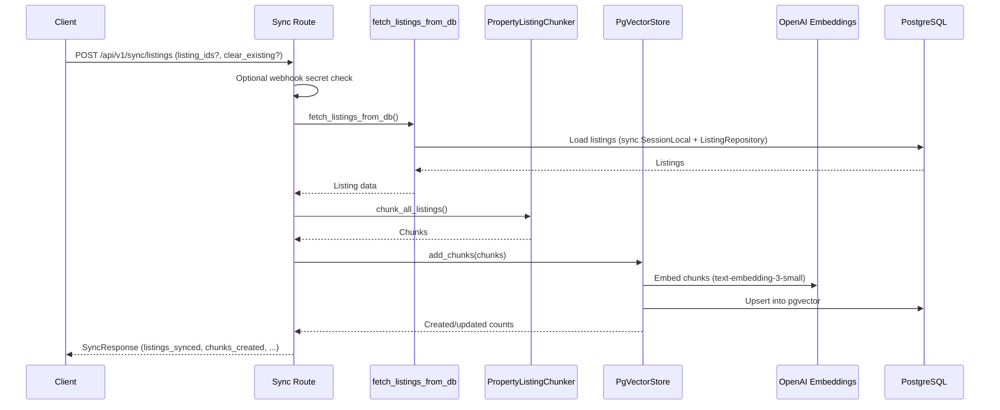
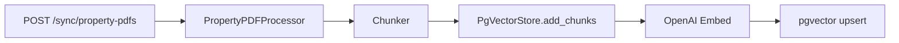
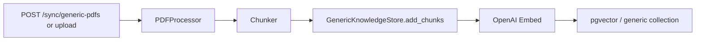

# Sync and Ingestion

Sync endpoints populate the vector store (pgvector for listings and property PDFs; generic knowledge store for generic PDFs). They are typically called by webhooks or cron when listings or documents change.

---

## Sync Flow (Listings)

---

## Sync Flow (Property PDFs)

---

## Sync Flow (Generic PDFs)

---

## Key Components

| Component | Location | Role |
|-----------|----------|------|
| Sync routes | `app/api/v1/routes/sync.py` | Listings, property-pdfs, generic-pdfs (sync + async + upload variants) |
| Listings from DB | `app/helpers/ingestion_pipeline/property/db_loader.py` | fetch_listings_from_db (sync SessionLocal) |
| Property chunker | `app/helpers/ingestion_pipeline/property/` + shared chunker | Chunk listing data for embedding |
| PgVectorStore | `app/helpers/ingestion_pipeline/property/pgvector_store.py` | Add/update property chunks; uses OpenAI embeddings |
| GenericKnowledgeStore | `app/helpers/ingestion_pipeline/generic/generic_knowledge_store.py` | Add/update generic doc chunks |
| Property PDF processor | `app/helpers/ingestion_pipeline/property/property_pdf_processor.py` | Load and process property PDFs |
| Shared PDF processor | `app/helpers/ingestion_pipeline/shared/pdf_processor.py` | Generic PDF fetch/parse |

---

## Endpoints Summary

| Endpoint | Purpose |
|----------|---------|
| `POST /api/v1/sync/listings` | Sync listing data → chunks → pgvector |
| `POST /api/v1/sync/listings-async` | Same, returns immediately; work in background |
| `POST /api/v1/sync/property-pdfs` | Sync property PDFs for given listings |
| `POST /api/v1/sync/property-pdfs-async` | Same, async |
| `POST /api/v1/sync/generic-pdfs` | Sync generic knowledge PDFs (re_index option) |
| `POST /api/v1/sync/generic-pdfs-async` | Same, async |
| `POST /api/v1/sync/generic-pdfs/upload` | Upload files for generic PDF sync |
| `GET /api/v1/sync/status` | Vector store status (counts, model, etc.) |

---

## Modifications Guide

- **Change chunking or schema:** Property chunker, generic chunker; entity/table names in pgvector_store and generic_knowledge_store.
- **Change embedding model:** Where PgVectorStore and GenericKnowledgeStore create the embedding client (e.g. OpenAI model name).
- **Webhook auth:** Sync route checks for `x_webhook_secret` and `REQUIRE_WEBHOOK_SECRET` / `WEBHOOK_SECRET`.
- **Limits (file size, count):** Env vars such as `GENERIC_PDF_MAX_MB`, `GENERIC_PDF_MAX_FILES` and validation in upload endpoints.
