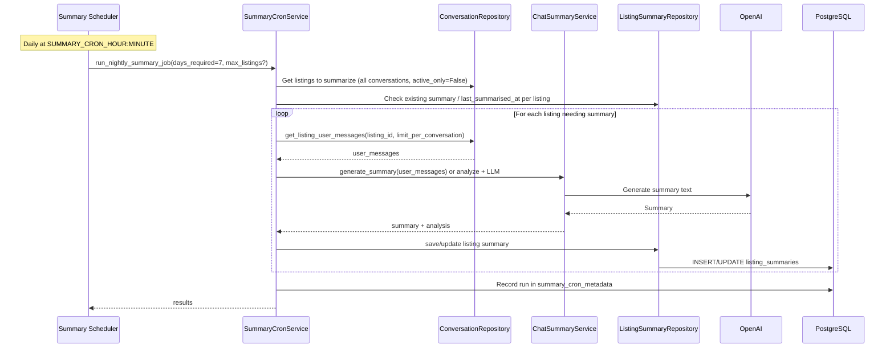
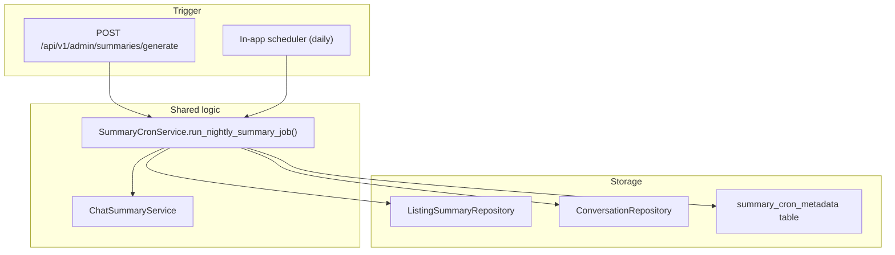
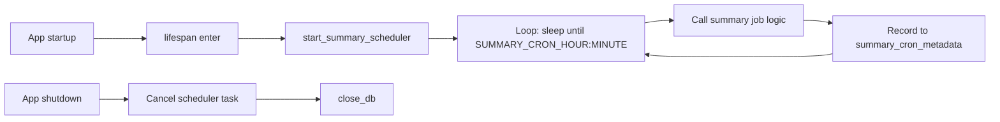

# Summaries and Cron

Property-level chat summaries aggregate conversation themes and query patterns for each listing. They are used by the admin API and generated on a schedule by an in-app cron.

---

## Summary Generation Flow

---

## Admin vs Cron

---

## Scheduler Lifecycle (main.py)

- Scheduler runs inside the FastAPI process (asyncio task).
- Configure: `ENABLE_INAPP_SUMMARY_CRON`, `SUMMARY_CRON_HOUR`, `SUMMARY_CRON_MINUTE` (e.g. 11 and 50 for 11:50).

---

## Key Components

| Component | Location | Role |
|-----------|----------|------|
| Summary scheduler | `app/scheduler/summary_scheduler.py` | Daily run at configured time; calls cron service and records run |
| SummaryCronService | `app/services/summary_cron_service.py` | Decides which listings need summaries; gets user messages; calls ChatSummaryService; persists to ListingSummaryRepository and records each run in `summary_cron_metadata` |
| ChatSummaryService | `app/services/chat_summary_service.py` | analyze_conversations; LLM-based summary generation; pointwise/bullet style |
| ListingSummaryRepository | `app/db/postgres/repositories/listing_summary_repository.py` | get_by_listing_id, save/update listing summary |
| CronJobRun model | `app/db/models/cron_job_run.py` | Table `summary_cron_metadata`: job_name, ran_at, status, message |
| Admin endpoints | `app/api/v1/routes/admin.py` | GET listing summary; POST trigger_summary_generation |

---

## Modifications Guide

- **Change summary content or style:** Prompts and generation in `chat_summary_service.py`.
- **Change who gets summarized:** `summary_cron_service.py` (e.g. active_only=False for all conversations).
- **Change schedule:** `SUMMARY_CRON_HOUR`, `SUMMARY_CRON_MINUTE`; or edit `summary_scheduler.py`.
- **Disable in-app cron:** `ENABLE_INAPP_SUMMARY_CRON=false`; call `POST /api/v1/admin/summaries/generate` externally (e.g. system cron).
- **Schema for summary or cron run:** `app/db/models/listing_summary.py`, `cron_job_run.py`, and their repositories.
